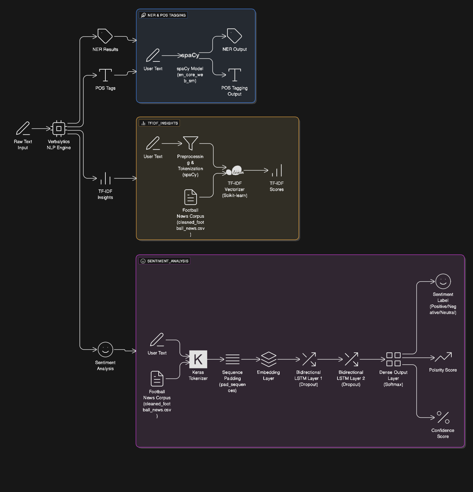
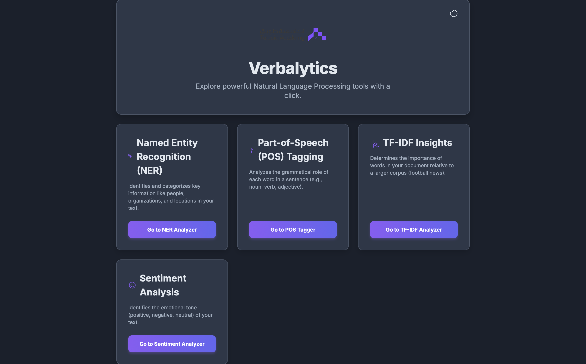
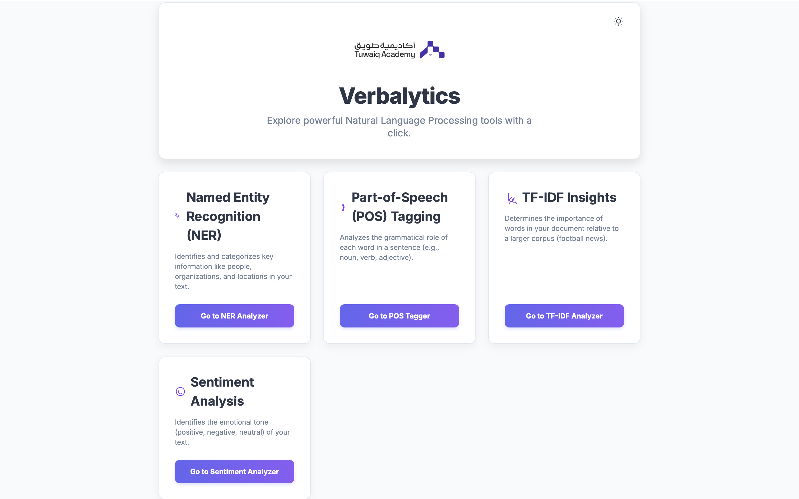
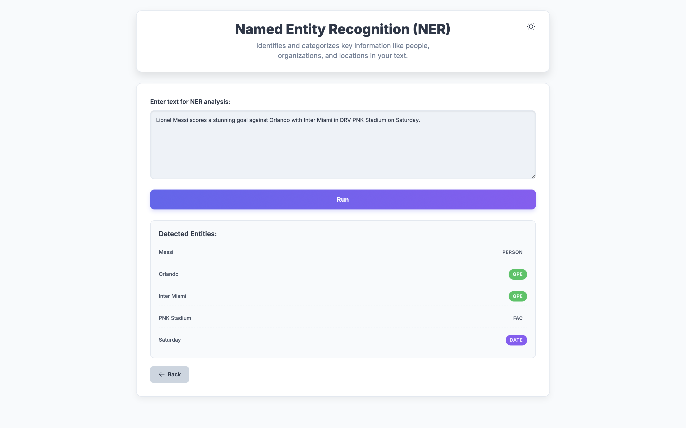
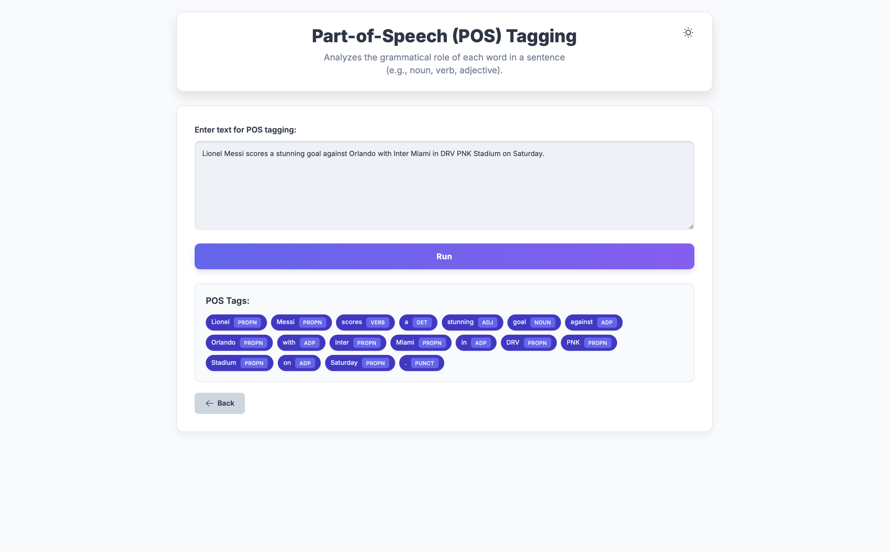
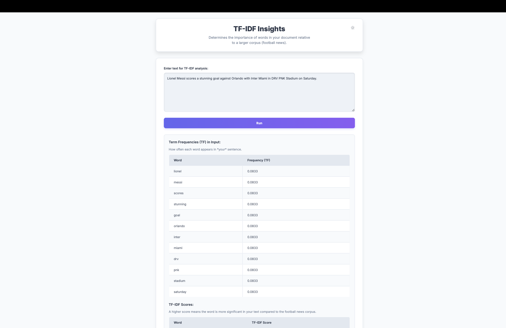
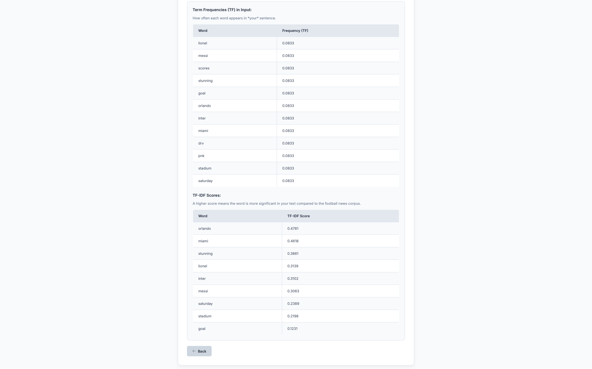
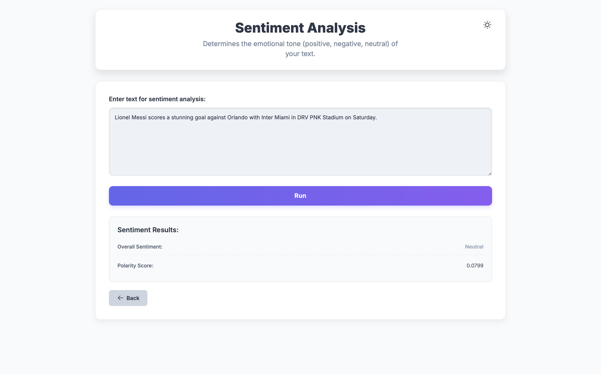

# V E R B A L Y T I C S 🚀

## Project Overview

Verbalytics is a modular web application designed to demonstrate fundamental Natural Language Processing (NLP) tasks. It provides a user-friendly interface to analyze text for Named Entity Recognition (NER) 🏷️, Part-of-Speech (POS) Tagging 📚, TF-IDF insights 📊, and Sentiment Analysis 😊. The project is built with a Python Flask backend and a modern HTML/CSS/JavaScript frontend, featuring an adaptive light/dark theme 🌗.

## Features ✨

* **Named Entity Recognition (NER):** Identify and classify named entities (e.g., persons 🧑‍🤝‍🧑, organizations 🏢, locations 📍, dates 📅) in input text.

* **Part-of-Speech (POS) Tagging:** Determine the grammatical category (e.g., noun, verb, adjective) of each word in a sentence 📝.

* **TF-IDF Insights:** Calculate Term Frequency (TF) and TF-IDF scores to highlight the importance of words in a document relative to a specified corpus (football news) ⚽.

* **Sentiment Analysis:** Classify the emotional tone of text as Positive 😄, Negative 😠, or Neutral 😐 using a deep learning (LSTM) model.

* **Adaptive Theme:** Seamlessly switch between light and dark modes ☀️🌙, with preference saved in your browser.

* **Modular Design:** Separate pages and backend routes for each NLP function, ensuring a clean and scalable architecture 🏗️.

## Technologies Used 🛠️

* **Backend:** Python 3 🐍, Flask 🌐

* **NLP Libraries:**

    * [spaCy](https://spacy.io/): For efficient NER and POS tagging. 🧠

    * [Scikit-learn](https://scikit-learn.org/): For `TfidfVectorizer`. 🔬

    * [TensorFlow](https://www.tensorflow.org/) & [Keras](https://keras.io/): For building and training the LSTM sentiment model. 🧠

* **Frontend:**

    * HTML5 Markup 📄

    * CSS3 Styling (with [Tailwind CSS](https://tailwindcss.com/) for utility-first styling) 🎨

    * JavaScript interactivity 💻

* **Data Handling:** Pandas 🐼 (for CSV processing in model creation)

## Project Structure 📁

```
Verbalytics/
├── static/
│   └── logo-h.png          # Project logo (Tuwaiq Academy) 🏞️
├── templates/
│   ├── index.html          # Welcome page / NLP Hub 🏠
│   ├── ner.html            # Dedicated page for NER 🏷️
│   ├── pos.html            # Dedicated page for POS Tagging 📚
│   ├── tfidf.html          # Dedicated page for TF-IDF 📊
│   └── sentiment.html      # Dedicated page for Sentiment Analysis 😊
├── models/                 # Pre-trained NLP models 🤖
│   ├── tfidf_vectorizer.pkl # Saved TF-IDF model
│   ├── sentiment_model.keras # Saved Keras sentiment model
│   └── sentiment_tokenizer.json # Saved tokenizer for sentiment model
├── cleaned_football_news.csv # Corpus for TF-IDF training (Source: [Kaggle Football News Articles](https://www.kaggle.com/datasets/hammadjavaid/football-news-articles/data)) 📰
├── your_sentiment_labeled_data.csv # Placeholder for your own labeled sentiment data (optional) 📝
├── app.py                  # Flask backend application 💻
├── create_model.py         # Script to train and save NLP models ✨
├── name_entity.py          # Module for NER function 🧠
├── pos.py                  # Module for POS Tagging function 📜
├── sentiment.py            # Module for Sentiment Analysis function ❤️
└── tf_idf.py               # Module for TF-IDF calculation 🔍
```

## Setup Instructions ⚙️

Follow these steps to get Verbalytics up and running on your local machine:

### 1. Download the Project ⬇️

You can download this project by cloning the Git repository:

```bash
git clone [https://github.com/your-username/Verbalytics.git](https://github.com/your-username/Verbalytics.git) # Replace with your actual repository URL
cd Verbalytics
```

### 2. Create and Activate a Virtual Environment 🐍

It's highly recommended to use a virtual environment to manage dependencies.

```bash
python3 -m venv venv
source venv/bin/activate  # On macOS/Linux
# venv\Scripts\activate   # On Windows Command Prompt
# venv\Scripts\Activate.ps1 # On Windows PowerShell
```

### 3. Install Dependencies 📦

Install all required Python packages from `requirements.txt`.

```bash
pip install -r requirements.txt
```

### 4. Download SpaCy English Model 🌐

The `en_core_web_sm` model is essential for NER and POS tagging.

```bash
python -m spacy download en_core_web_sm
```

### 5. Prepare Data and Create NLP Models 📊

This script will train and save the `tfidf_vectorizer`, `sentiment_model.keras`, and `sentiment_tokenizer.json` into the `models/` directory.

**Note on Sentiment Model Accuracy:** The `create_model.py` script currently trains the sentiment model using `cleaned_football_news.csv` with *randomly generated sentiment labels*. For meaningful sentiment analysis, you **must** provide your own truly human-labeled dataset. Instructions for this are within the `create_model.py` file.

```bash
python create_model.py
```

### 6. Run the Flask Application ▶️

```bash
python app.py
```

The application will typically be accessible at `http://127.0.0.1:5000/` in your web browser. 🌐

## Usage 💡

1.  Navigate to `http://127.0.0.1:5000/` in your web browser.

2.  The welcome page will display cards for each NLP function.

3.  Click on any card (e.g., "Go to NER Analyzer") to navigate to its dedicated page.

4.  On the function's page, enter your text into the provided textarea and click the "Run Analysis" button.

5.  View the results displayed below the input area.

6.  Use the theme toggle button in the header to switch between light and dark modes. Your preference will be saved locally.

## Model Architecture Diagram 🧠🌐


## Screenshots 📸

Here are some screenshots showcasing the Verbalytics web interface and its features:

### Welcome Page - Dark Mode


### Welcome Page - Light Mode


### Named Entity Recognition (NER) Page


### Part-of-Speech (POS) Tagging Page


### TF-IDF Analysis Page 1


### TF-IDF Analysis Page 2


### Sentiment Analysis Page


## Project Demo Video 🎬

Check out a quick demo of Verbalytics in action!

[](https://www.youtube.com/watch?v=TwXtaj8lykU)


## Credits & Acknowledgements 🙏

* Developed by **Mustafa Al Ali**. 🧑‍💻
* Developed as a project for **AI Diploma**. 🎓

* Built using open-source libraries: Flask, spaCy, Scikit-learn, TensorFlow, Keras, Pandas, Tailwind CSS. 💻
